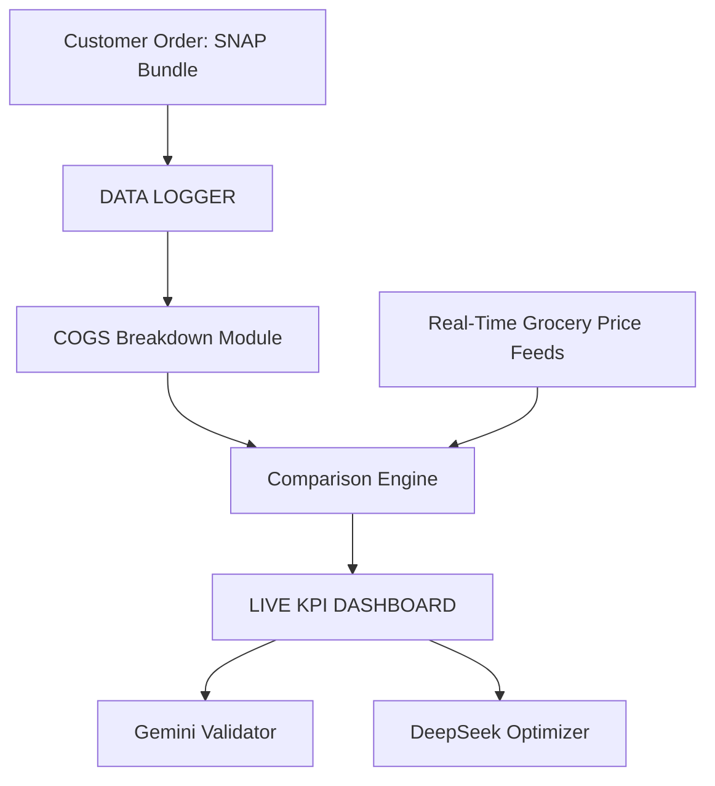

## Azure Python Starter Template

This repository provides a starter template for creating applications using Microsoft Azure services, emphasizing easy setup for authentication, API, and storage capabilities.

## Overview

This template equips you with a foundational Python application integrated with Azure, streamlined for scalability and performance. It is ideal for developers looking to jumpstart their project with pre-configured Azure resources.

## Features

- **Authentication**: Placeholder setup for Azure Active Directory integration.
- **Storage**: Uses Azure Blob Storage for persisting data.
- **Alerts**: Simple alert system that can be extended for Azure Monitor.

## Deploying to Azure

Refer to the official Azure documentation for deployment steps tailored to your environment.

## Security

See [CONTRIBUTING](CONTRIBUTING.md#security-issue-notifications) for more information.

## License

This library is licensed under the MIT-0 License. See the LICENSE file.

## Data Logger Architecture

The project includes a simple data logger that records order and pricing information. Logs are stored in the `logs` directory.

### System Diagram

### Adding Logs

1. Place JSON log files into `logs`. See `logs/README.md` for format details.
2. Each log should capture the customer order, prices pulled from the API, and any processed KPI results.

These logs can later be processed by analytics tools or uploaded to your data warehouse.
