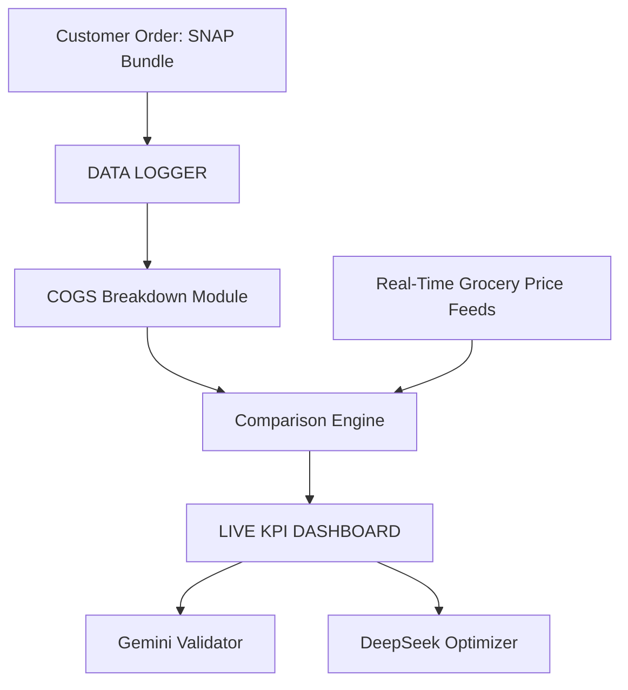

## AWS Amplify React+Vite Starter Template

This repository provides a starter template for creating applications using React+Vite and AWS Amplify, emphasizing easy setup for authentication, API, and database capabilities.

## Overview

This template equips you with a foundational React application integrated with AWS Amplify, streamlined for scalability and performance. It is ideal for developers looking to jumpstart their project with pre-configured AWS services like Cognito, AppSync, and DynamoDB.

## Features

- **Authentication**: Setup with Amazon Cognito for secure user authentication.
- **API**: Ready-to-use GraphQL endpoint with AWS AppSync.
- **Database**: Real-time database powered by Amazon DynamoDB.

## Deploying to AWS

For detailed instructions on deploying your application, refer to the [deployment section](https://docs.amplify.aws/react/start/quickstart/#deploy-a-fullstack-app-to-aws) of our documentation.

## Security

See [CONTRIBUTING](CONTRIBUTING.md#security-issue-notifications) for more information.

## License

This library is licensed under the MIT-0 License. See the LICENSE file.
## Data Logger Architecture

The project includes a simple data logger that records order and pricing information. Logs are stored in the `data/logger` directory.

### System Diagram



### Adding Logs

1. Place JSON log files into `data/logger`. See `data/logger/README.md` for format details.
2. Each log should capture the customer order, prices pulled from the API, and any processed KPI results.

These logs can later be processed by analytics tools or uploaded to your data warehouse.

### Dataset Layout

Additional structured data is stored under the `data_logger` directory. This dataset is organized into three main areas:

```
/data_logger/
  ├── raw_data/            # CSV exports from daily operations
  ├── trigger_logs/        # Grant and investor signals
  └── quant_search/        # Reference material from public programs
```

See `data_logger/README.md` for details about each folder and the files that belong there.
