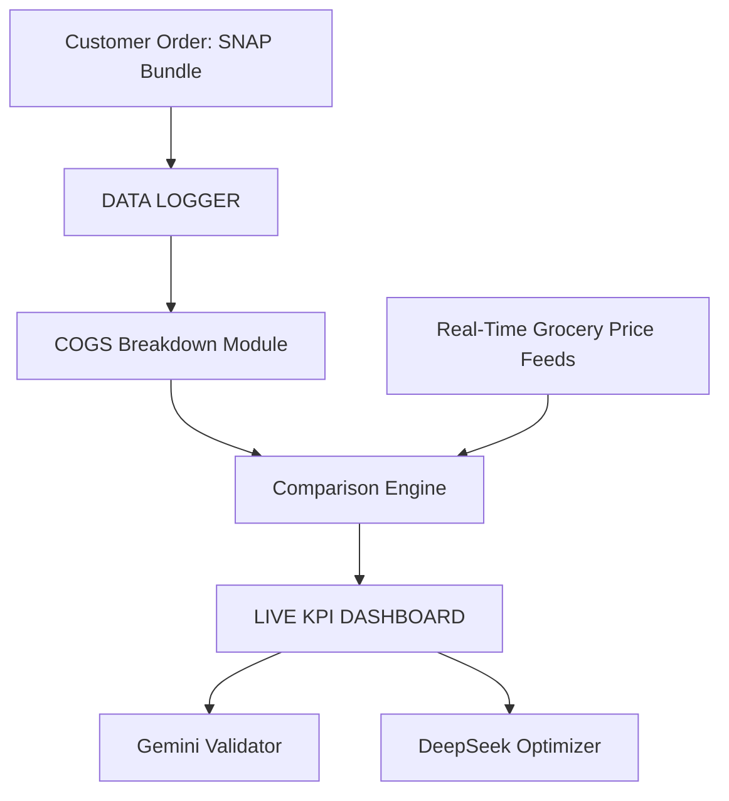

## AWS Amplify React+Vite Starter Template

This repository provides a starter template for creating applications using React+Vite and AWS Amplify, emphasizing easy setup for authentication, API, and database capabilities.

## Overview

This template equips you with a foundational React application integrated with AWS Amplify, streamlined for scalability and performance. It is ideal for developers looking to jumpstart their project with pre-configured AWS services like Cognito, AppSync, and DynamoDB.

## Features

- **Authentication**: Setup with Amazon Cognito for secure user authentication.
- **API**: Ready-to-use GraphQL endpoint with AWS AppSync.
- **Database**: Real-time database powered by Amazon DynamoDB.

## Deploying to AWS

For detailed instructions on deploying your application, refer to the [deployment section](https://docs.amplify.aws/react/start/quickstart/#deploy-a-fullstack-app-to-aws) of our documentation.

## Security

See [CONTRIBUTING](CONTRIBUTING.md#security-issue-notifications) for more information.

## License

This library is licensed under the MIT-0 License. See the LICENSE file.
## Data Logger Architecture

The project includes a simple data logger that records order and pricing information. Logs are stored in the `data/logger` directory.

### System Diagram

### Adding Logs

1. Place JSON log files into `data/logger`. See `data/logger/README.md` for format details.
2. Each log should capture the customer order, prices pulled from the API, and any processed KPI results.
3. Run `python data/logger/validate_log.py` to ensure all log files match the expected schema before using them in other modules.

These logs can later be processed by analytics tools or uploaded to your data warehouse.

## LLM Command Center

This project now includes specialized folders for integrating with large language models such as **Gemini Ultra**, **DeepSeek**, and **Mariner**. Use these resources to audit data, trigger prompts, and map incoming information into consistent formats.

### Folder Overview

- **`schemas/`** – JSON and YAML schemas defining the structure of logs and API payloads.
- **`prompts/`** – Prompt templates and auto-tagging rules for LLM-driven analysis.
- **`maps/`** – Mapping files to translate raw data into the formats expected by your schemas and prompts.

### Quant Logic Formats

Schemas and maps support JSON and CSV ingestions. KPI fields such as margin, delivery cost, and multipliers are validated against `schemas/data_audit_schema.json`.

### Next Steps for Auto‑Tagging

1. Define additional rules in `prompts/triggers.json` to tag records based on KPI thresholds.
2. Point your ingestion pipeline to the `maps/ingestion_map.yaml` file so new data aligns with the schemas.
3. Customize `prompts/sample_prompt.md` or create new prompts for the actions you wish to automate.

These resources can be activated immediately with your LLM provider of choice to streamline reporting and anomaly detection.
