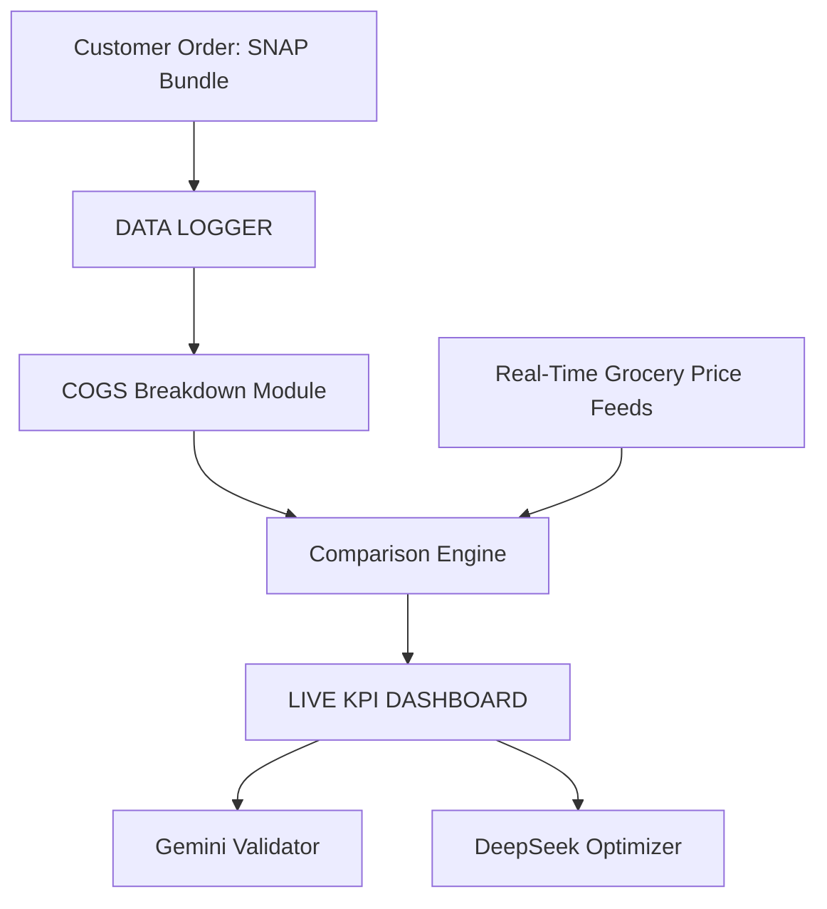

## Firebase React+Vite Starter Template

This repository provides a starter template for creating applications using React+Vite with Firebase and Google Cloud.

## Overview

The template offers a basic React application integrated with Firebase. It is perfect for experimenting with Firebase Authentication and Firestore while keeping the codebase minimal.

## Features

- **Authentication**: Easily connect Firebase Authentication for secure sign-in.
- **Database**: Real-time data storage using Cloud Firestore.
- **Hosting**: Ready to deploy on Firebase Hosting or other Google Cloud platforms.

## Setup

1. Create a `.env` file in the project root with your Firebase project configuration:

```bash
VITE_FIREBASE_API_KEY=<api key>
VITE_FIREBASE_AUTH_DOMAIN=<auth domain>
VITE_FIREBASE_PROJECT_ID=<project id>
VITE_FIREBASE_STORAGE_BUCKET=<storage bucket>
VITE_FIREBASE_MESSAGING_SENDER_ID=<messaging sender id>
VITE_FIREBASE_APP_ID=<app id>
```

2. Install dependencies with `npm install` and start the development server:

```bash
npm run dev
```

## Security

See [CONTRIBUTING](CONTRIBUTING.md#security-issue-notifications) for more information.

## License

This library is licensed under the MIT-0 License. See the LICENSE file.
## Data Logger Architecture

The project includes a simple data logger that records order and pricing information. Logs are stored in the `data/logger` directory.

### System Diagram



### Adding Logs

1. Place JSON log files into `data/logger`. See `data/logger/README.md` for format details.
2. Each log should capture the customer order, prices pulled from the API, and any processed KPI results.
3. Run `python data/logger/validate_log.py` to ensure all log files match the expected schema before using them in other modules.

These logs can later be processed by analytics tools or uploaded to your data warehouse.
