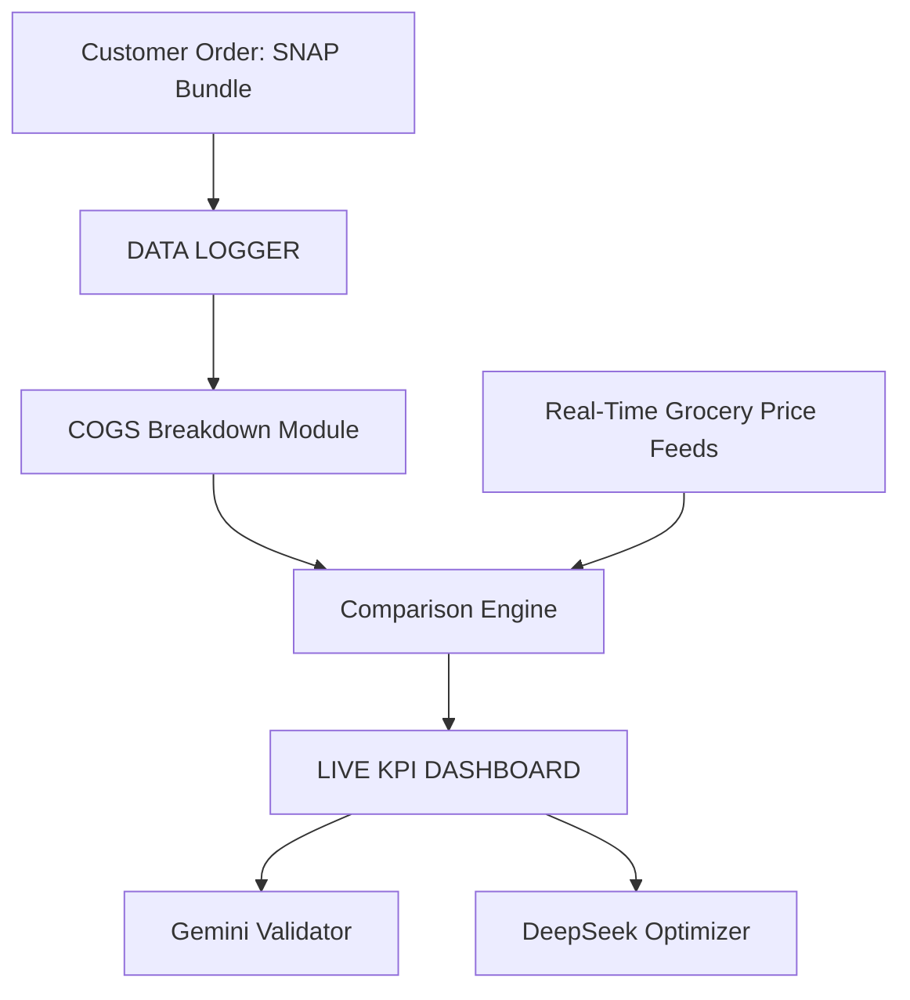

# 360 Market Data Logger

This repository provides a reference implementation for logging customer orders and pricing data. It includes an AWS Amplify frontend and Python utilities for log validation.

## Logger

The logger requires **Python 3.8+**. Validate new log files with:

```bash
python data/logger/validate_log.py
# or on Windows PowerShell
./scripts/validate_logs.ps1
```

## License

This library is licensed under the MIT-0 License. See the [LICENSE](LICENSE) file for details.

## Data Logger Architecture

Logs are stored in `data/logger`. The following diagram shows the flow of data between modules:



### Adding Logs

1. Place JSON log files into `data/logger` (see [`data/logger/README.md`](data/logger/README.md) for the schema).
2. Each log should capture the customer order, prices from the API, and any processed KPI results.
3. Run the validation script before committing new logs.
4. Optionally run `python data/logger/summarize_logs.py` (or `./scripts/summarize_logs.ps1` on Windows) to aggregate metrics and generate a Gemini summary.

These logs can later be processed by analytics tools or uploaded to your data warehouse.

## Continuous Integration

GitHub Actions run the validator whenever log files change. The workflow file is located at `.github/workflows/validate-logs.yml`.
