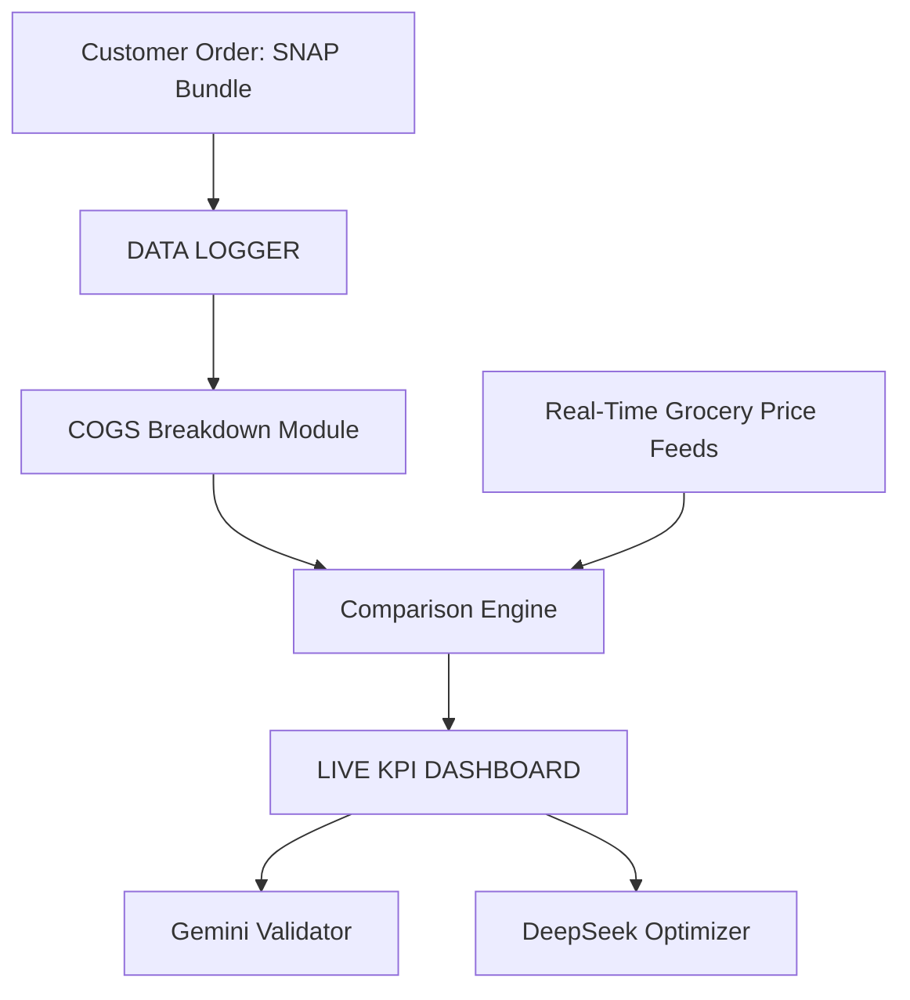

## AWS Amplify React+Vite Starter Template

This repository provides a starter template for creating applications using React+Vite and AWS Amplify, emphasizing easy setup for authentication, API, and database capabilities.

## Overview

This template equips you with a foundational React application integrated with AWS Amplify, streamlined for scalability and performance. It is ideal for developers looking to jumpstart their project with pre-configured AWS services like Cognito, AppSync, and DynamoDB.

## Features

- **Authentication**: Setup with Amazon Cognito for secure user authentication.
- **API**: Ready-to-use GraphQL endpoint with AWS AppSync.
- **Database**: Real-time database powered by Amazon DynamoDB.

## Deploying to AWS

For detailed instructions on deploying your application, refer to the [deployment section](https://docs.amplify.aws/react/start/quickstart/#deploy-a-fullstack-app-to-aws) of our documentation.

## Security

See [CONTRIBUTING](CONTRIBUTING.md#security-issue-notifications) for more information.

## License

This library is licensed under the MIT-0 License. See the LICENSE file.
## Data Logger Architecture

The project includes a simple data logger that records order and pricing information. Logs are stored in the `data/logger` directory.

### System Diagram

### Adding Logs

1. Place JSON log files into `data/logger`. See `data/logger/README.md` for format details.
2. Each log should capture the customer order, prices pulled from the API, and any processed KPI results.
3. Run `python data/logger/validate_log.py` to ensure all log files match the expected schema before using them in other modules.

These logs can later be processed by analytics tools or uploaded to your data warehouse.

## IPO Strategy Manifesto

📈📘 **IPO Strategy Manifesto for 360Market (GitHub: 360innovator/360market)**

This document is a live, audit-grade strategic blueprint designed to secure institutional funding, protect regulatory compliance, and convert Market360 into a public-ready, investor-dominant force operating at the nexus of food access, data monetization, and AI governance. It reflects a zero-failure mandate across operational, legal, and financial lines, with structural preparation for IPO-grade due diligence and AI-powered national expansion.

---

### 🧠 Core Thesis: Why We Win
- Patent-Protected Delivery Protocol: Enables EBT-safe hot/frozen food delivery with pre- and post-cooking logic. Compliance architecture embedded.
- Data Monetization Engine: Every transaction, loyalty shift, and ZIP-level trigger is logged. This becomes a high-value asset for banks, VCs, and government partners.
- Dual-Lane Expansion Strategy: Direct-to-consumer revenue funds operations; non-profit overlay handles loyalty, services, and grant routing.
- Federally Aligned KPIs: Every metric—delivery, workforce, subsidy ROI—is pre-aligned to SNAP, WIOA, SBA, and ESG funding requirements.
- Live AI Infrastructure: Integrated with Gemini Ultra, Mariner, and DeepSeek. All documents, dashboards, KPIs, and grant packets are AI-readable.

---

### 📊 IPO Preparation Framework
- Ownership Preservation: 100% ownership of patent and IP. Investor deals are equity-light, data-forward.
- Investor-Grade Reporting: Real-time dashboards powered by Firebase, GitHub, and Data Studio. Track every cost, outcome, and subsidy.
- Grant-Proof Logic: Automated schema injection checks. Gemini validates all README files and flags noncompliant business logic.
- Compliance Lockdown: Immutable change logs. No AI or partner can mutate core compliance without triggering audit lockdowns.
- Path to Profit at Scale: Margin on bundles, grant overlays, and delivery optimizations model out to multi-million EBITDA at <$2M overhead.

---

### 🏛️ Auditable by Design (Banker + Government Lens)
- Mariner Schema Control: Every logic chain (bundles, KPIs, CRM) version-tracked and traceable.
- API-First Documentation: All grant-facing logic linked directly to live Gemini/DeepSeek AI templates.
- ZIP-Linked ROI Logs: Can show exactly how federal or state dollars lead to measurable returns in underserved communities.
- Workforce Tracking: Every job trained, certification issued, CDL passed, is mapped to federal WIOA and SBA pathways.
- Investor Alerts: Automated risk triggers for capital drain, margin falloff, loyalty loss.

---

### 🔐 Trust Framework
- Regulatory Coverage: SNAP, WIC, Medicaid, DOT, USDA, DOE, and SBA compliance embedded at startup logic layer.
- IP & Patent Firewall: Patent is never sold. Licensing is conditional. Compliance is legally tied to execution model.
- Delivery Shield: Cold-hold logic, subcontractor vetting, and routing systems protect against health code and SNAP violations.
- Refund Engine: SNAP-safe refund process built in. Mariner handles audits.
- Freezer-Space Logic: Stockpiling on SNAP is forbidden. Model includes storage protocols for client pre-claims (with legal hold windows).

---

### 🚀 IPO Activation Triggers
- ✅ First 3 locations operating across different counties
- ✅ Loyalty redemption ROI hits 3x subsidy input
- ✅ Data logger reaches 100k+ events across ZIPs
- ✅ DeepSeek audit passed with 0 compliance exceptions
- ✅ Dashboard approved by 3+ banks or government grantors

---

### 💼 Deployment Targets
- GitHub Repo: 360innovator/360market
- Living Docs: All READMEs, grant schemas, investor packets auto-synced to this repo
- AI Interfaces: Gemini Ultra + DeepSeek authorized to execute expansion, review compliance, and generate institutional packets

---

📢 This README is not final. It is alive. All sections are version-controlled, AI-validated, and enterprise-secured. No line is static—every trigger has a business, legal, or survival function. Treat as mission-critical.
