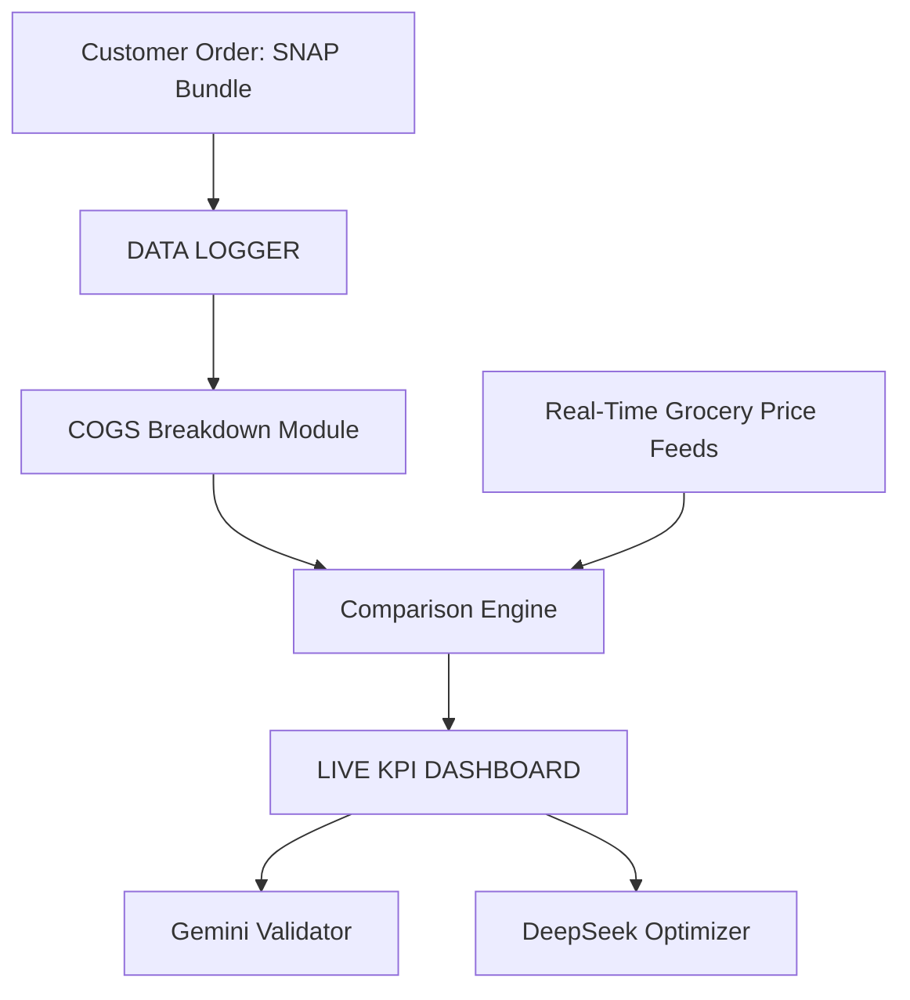

## Firebase React+Vite Starter Template

This repository began as an AWS Amplify template but has since shifted to **Firebase** for all backend services. It still uses React+Vite on the front end while leveraging Firebase for authentication, database, and hosting.

## Overview

This template equips you with a foundational React application integrated with **Firebase**. It is ideal for developers looking to jumpstart their project with pre-configured Firebase services like Authentication, Firestore, and Cloud Functions.

## Features

- **Authentication**: Managed through Firebase Authentication.
- **API**: Backend functionality can be implemented with Firebase Cloud Functions.
- **Database**: Real-time data is stored in Firebase Firestore.

## Deploying to Firebase

The original Amplify deployment workflow is no longer used. To deploy on Firebase:
1. Install the Firebase CLI.
2. Run `firebase init` to configure hosting and functions.
3. Build the project with `npm run build` and deploy using `firebase deploy`.

## Security

See [CONTRIBUTING](CONTRIBUTING.md#security-issue-notifications) for more information.

## License

This library is licensed under the MIT-0 License. See the LICENSE file.
## Data Logger Architecture

The project includes a simple data logger that records order and pricing information. Logs are stored in the `data/logger` directory.

### System Diagram

### Adding Logs

1. Place JSON log files into `data/logger`. See `data/logger/README.md` for format details.
2. Each log should capture the customer order, prices pulled from the API, and any processed KPI results.

These logs can later be processed by analytics tools or uploaded to your data warehouse.
For a detailed architecture overview, see [docs/enterprise_data_logger_blueprint.md](docs/enterprise_data_logger_blueprint.md).

### Progress

See [docs/progress_report.md](docs/progress_report.md) for a summary of current work and recommended next steps.

### Legacy Amplify Files

The repository still contains an `amplify` directory and `amplify.yml` from the
original AWS setup. These are not used with the Firebase deployment and may be
deleted if you do not plan to deploy on AWS.
