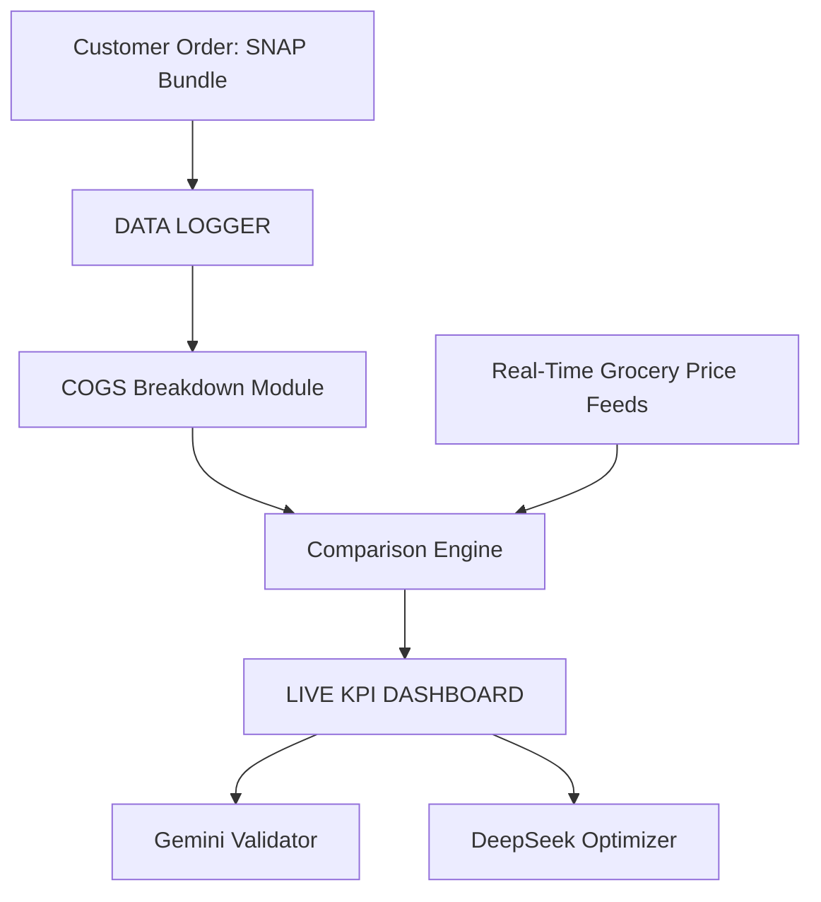

### Logger

This repository requires **Python 3.8+** to run the logger and tests.

Validate logs with:


## License

This library is licensed under the MIT-0 License. See the LICENSE file.
## Data Logger Architecture

The project includes a simple data logger that records order and pricing information. Logs are stored in the `data/logger` directory.

### System Diagram



### Adding Logs

1. Place JSON log files into `data/logger`. See `data/logger/README.md` for format details.
2. Each log should capture the customer order, prices pulled from the API, and any processed KPI results.
3. Run `python data/logger/validate_log.py` to ensure all log files match the expected schema before using them in other modules.
4. Optionally run `python data/logger/summarize_logs.py` to aggregate metrics and generate a brief Gemini-based summary.

These logs can later be processed by analytics tools or uploaded to your data warehouse.

## Continuous Integration

Log validation runs automatically via GitHub Actions. The workflow
located at `.github/workflows/validate-logs.yml` executes
`python data/logger/validate_log.py` whenever log files change. This
prevents invalid logs from being merged.

Run the script locally with:

```bash
python data/logger/validate_log.py
# or on Windows PowerShell
./scripts/validate_logs.ps1
```
