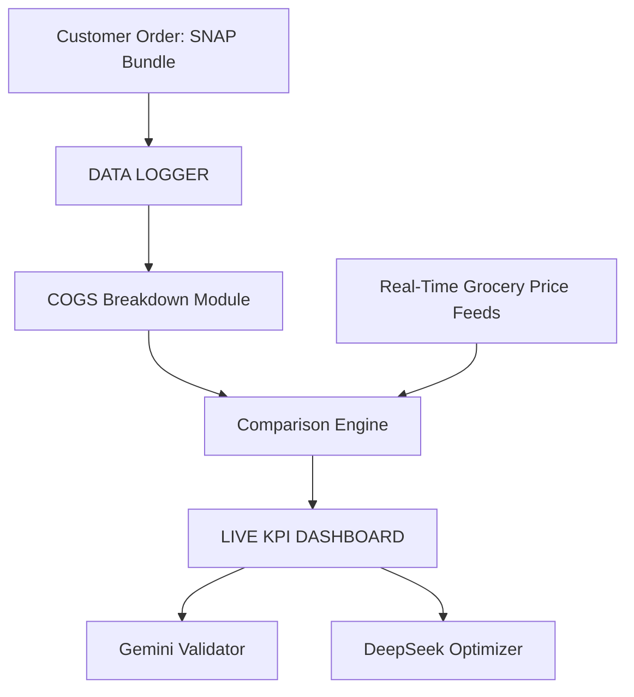

# System Diagram

The data logger interacts with pricing, cost, and KPI modules to feed analytics dashboards.

```mermaid
graph TD
    SNAP_Bundle[Customer Order: SNAP Bundle]
    DataLogger[DATA LOGGER]
    PriceAPI[Real-Time Grocery Price Feeds]
    CostModule[COGS Breakdown Module]
    ComparisonEngine[Comparison Engine]
    KPIDashboard[LIVE KPI DASHBOARD]
    GeminiAI[Gemini Validator]
    DeepSeekAI[DeepSeek Optimizer]

    SNAP_Bundle --> DataLogger
    DataLogger --> CostModule
    CostModule --> ComparisonEngine
    PriceAPI --> ComparisonEngine
    ComparisonEngine --> KPIDashboard
    KPIDashboard --> GeminiAI
    KPIDashboard --> DeepSeekAI
```
