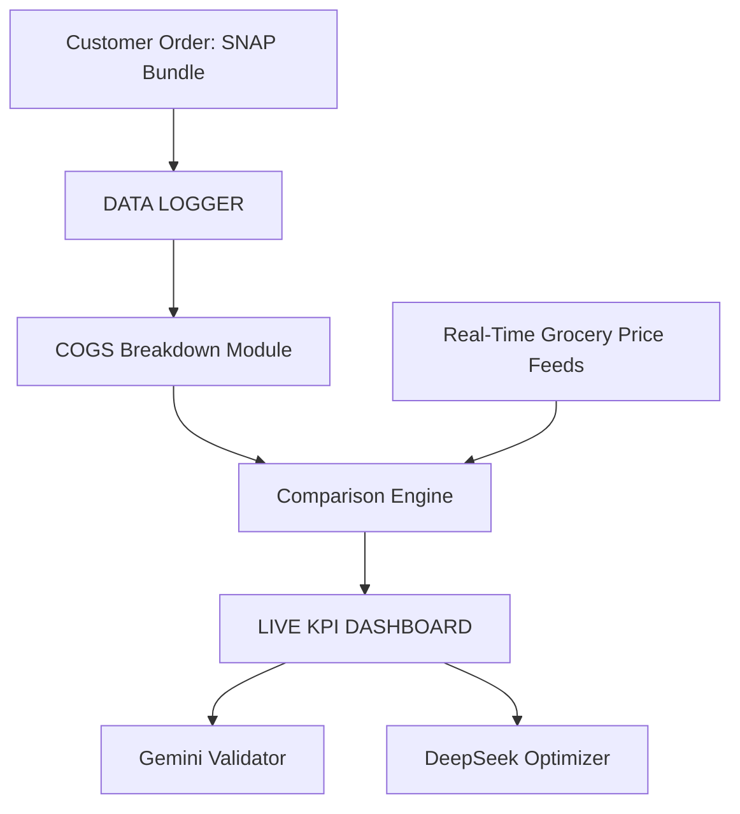

# Data Flow Diagram

The following Mermaid diagram illustrates the relationship between the data logger and related modules used in this project.

This diagram matches the architecture described in the main `README.md` and is provided here for easy reference.
